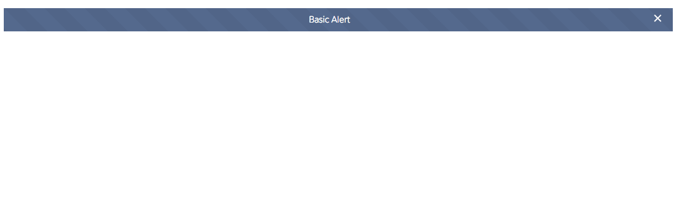
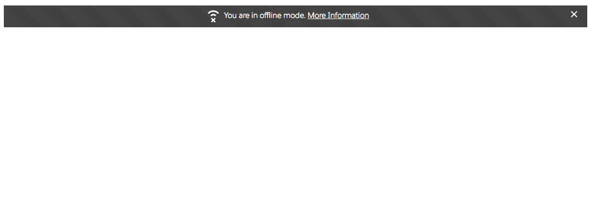
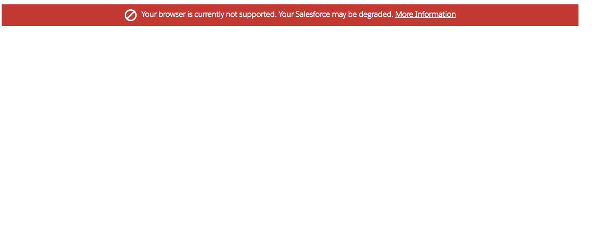

# Alert Component

Alerts are used to notify the users of an important event. Alerts are shown at the top of the screen.

An alert can have a close button which can fire the onClose event and hide the alert. Alerts also support a click event which can be used for navigation or to show a modal when an alert is clicked.

## Attributes
- show (Boolean) - Should this component be shown?
- theme	(String) -	Theme of the alert. Can be ether blank, success, error or offline
- texture	boolean) -	Should the alert have a texture
- hasCloseButton	(Boolean) -	Can this component be closed
- assistiveText	(String) -	Assistive text for this component

## Events
- onClick (ldsc:basicEvent) - Called when the alert is clicked.
- onClose (ldsc:basicEvent) - Called when the alert is closed.

## Examples

- Example 1

**Output**


**Component**
```html
<ldsc:LightningDesignApplication>
    <ldsc:alert onClose="{! c.alertClosed }" onClick="{! c.alertClicked }">
        Basic Alert
    </ldsc:alert>
</ldsc:LightningDesignApplication>
```

**Controller**
```js
({
    alertClicked : function(component, event, helper) {
		console.log('The alert was clicked', event.getSource());
	},

	alertClosed : function(component, event, helper) {
		console.log('The alert was closed', event.getSource());
	}
})
```

- Example 2

**Output**


**Component**
```html
<ldsc:LightningDesignApplication>
    <ldsc:alert theme="offline">
        <ldsc:icon class="slds-icon icon-text-email slds-icon--small slds-m-right--x-small" iconType="utility" iconName="offline">
        </ldsc:icon>You are in offline mode.
        <a href="#void">More Information</a>
    </ldsc:alert>
</ldsc:LightningDesignApplication>
```

- Example 3

**Output**


**Component**
```html
<ldsc:lightningDesignApplication>
    <ldsc:alert hasCloseButton="false" theme="error" assistiveText="Unsupported Browser" texture="false">
        <ldsc:icon iconType="utility" iconName="ban" class="slds-icon icon-text-email slds-icon--small slds-m-right--x-small"></ldsc:icon>Your browser is currently not supported. Your Salesforce may be degraded.
    <a href="#">More Information</a>
    </ldsc:alert>
</ldsc:lightningDesignApplication>
```
