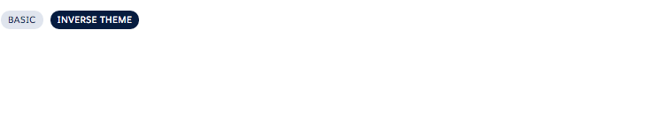

# Badge Component

A basic badge component.

## Attributes
- theme (String) - The theme of the badge. Can be either default,shade or inverse.

## Events
- onClick (ldsc:basicEvent) - The action to be called when the badge is clicked

## Example

**Output**


**Component**
```html
<ldsc:lightningDesignApplication>
    <ldsc:badge onClick="{! c.badgeClicked }">Basic</ldsc:badge>
    <ldsc:badge theme="inverse">Inverse Theme</ldsc:badge>
</ldsc:lightningDesignApplication>
```

**Controller**
```js
({
	badgeClicked : function(component, event, helper) {
		console.log('The badge was clicked.');
	}
})
```
