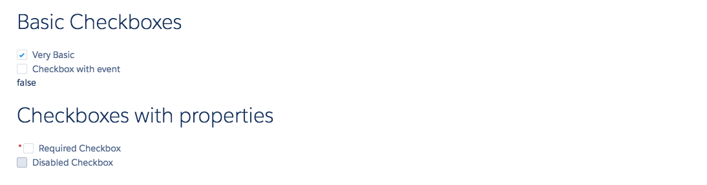

# Checkbox Component

Basic single checkbox in LDS. Fires the onChange event which the checkbox is checked or unchecked.

## Attributes
- name (String) - Name of the checkbox set.
- label	(String) - The label of the checkbox
- checked (Boolean) - Checked? True or False
- required (Boolean) - Is this field required? Displays a star next to the label. Does not actually perform the validation
- disabled (Boolean) - Is this field disabled?

## Events
- onChange (ldsc:basicEvent) - DOM event which is executed when the checkbox is changed.

## Example

**Output**


**Component**
```html
<aura:component>

    <aura:attribute access="PRIVATE" name="currentValueOfEvent" type="Boolean" default="false" description="Used to track current value of the checked event" />

	<ldsc:lightningDesignApplication>
        <h1 class="slds-text-heading--large">Basic Checkboxes</h1>
        <div class="slds-form-element">
            <ldsc:checkbox label="Very Basic" checked="true" />
            <ldsc:checkbox label="Checkbox with event" checked="{! v.currentValueOfEvent }" onChange="{! c.changeCurrentValue }"/>
            <h1>{! v.currentValueOfEvent }</h1>
        </div>

        <h1 class="slds-text-heading--large">Checkboxes with properties</h1>
        <div class="slds-form-element">
            <ldsc:checkbox label="Required Checkbox" required="true" />
            <ldsc:checkbox label="Disabled Checkbox" disabled="true" />
        </div>
    </ldsc:lightningDesignApplication>
</aura:component>
```

**Controller**
```js
({
	changeCurrentValue : function(component, event, helper) {
		component.set('v.currentValueOfEvent', event.getParam('value'));
	}
})
```

**Style**
```css
.THIS .slds-text-heading--large {
    margin-top: 20px;
    margin-bottom: 20px;
}

.THIS .slds-text-heading--medium {
    margin-top: 10px;
    margin-bottom: 10px;
}
```
