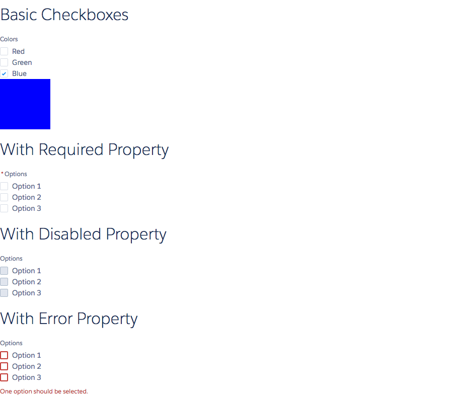

# Checkboxes Component

Multi checkbox component. Creates multiple checkboxes based on the labels and values provided. The labels property is a list of labels and the values property is a list of booleans indicating whether the checkbox was checked. The onChange event is executed when any of the checkboxes are changed and the value parameter of the event contains the new array.

## Attributes
- name (String) - Name of the checkboxes set. Must be unique for a group of checkboxes.
- groupLabel (String) - Label for the group of checkboxes
- labels (String[]) [Required] - List of labels to be shown
- values (Boolean[]) [Required] - Values of the checkboxes
- required (Boolean) - Is this field required? Displays a star next to the label. Does not actually perform the validation
- disabled (Boolean) - Is this field disabled?
- error (String) - The error message.

## Events
- onChange (ldsc:basicEvent) - DOM event which is executed when any of the checkboxes are changed. The value attribute contains the new array of values.

## Example

**Output**


**Component**
```html
<aura:component >

  <aura:handler name="init" value="{! this }" action="{! c.init }" />

  <aura:attribute name="colors" type="Boolean[]" description="Array of Colors" access="PRIVATE" />
  <aura:attribute name="options" type="Boolean[]" description="Array of Options" access="PRIVATE" />

  <ldsc:lightningDesignApplication>
        <h1 class="slds-text-heading--large">Basic Checkboxes</h1>

        <ldsc:checkboxes labels="Red,Green,Blue" values="{! v.colors }" groupLabel="Colors" onChange="{! c.colorChanged }"/>

        <div class="box" style="{! 'background-color: #'
                                + (v.colors[0] ? 'FF' : '00')
                                + (v.colors[1] ? 'FF' : '00')
                                + (v.colors[2] ? 'FF' : '00')}"></div>

        <h1 class="slds-text-heading--large">With Required Property</h1>
        <ldsc:checkboxes labels="Option 1,Option 2,Option 3" values="{! v.options }"
                         groupLabel="Options" required="true" />

        <h1 class="slds-text-heading--large">With Disabled Property</h1>
        <ldsc:checkboxes labels="Option 1,Option 2,Option 3" values="{! v.options }"
                         groupLabel="Options" disabled="true" />

        <h1 class="slds-text-heading--large">With Error Property</h1>
        <ldsc:checkboxes labels="Option 1,Option 2,Option 3" values="{! v.options }"
                         groupLabel="Options"
                         error="One option should be selected."/>
    </ldsc:lightningDesignApplication>
</aura:component>
```

**Controller**
```js
({
  init: function(component, event, helper) {
    component.set('v.colors', [false, false, true]);
    component.set('v.options', [false, false, false]);
  },

  colorChanged: function(component, event, helper) {
    component.set('v.colors', event.getParam('value'));
  }
})
```

**Style**
```css
.THIS .slds-text-heading--large {
    margin-top: 20px;
    margin-bottom: 20px;
}

.THIS .slds-text-heading--medium {
    margin-top: 10px;
    margin-bottom: 10px;
}

.THIS .box {
    width: 100px;
    height: 100px;
}
```
