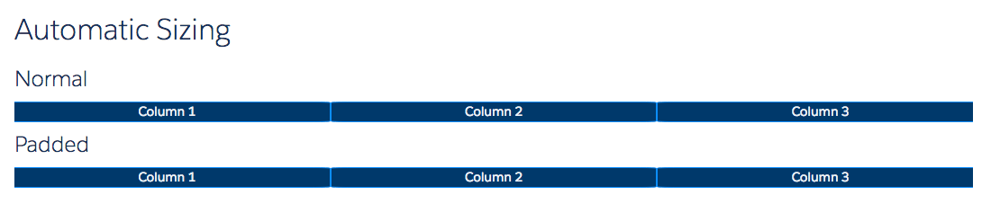
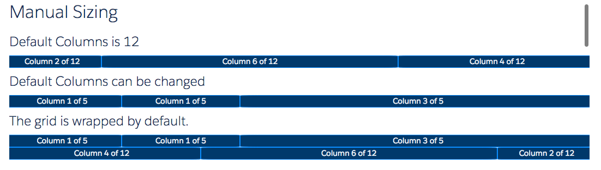
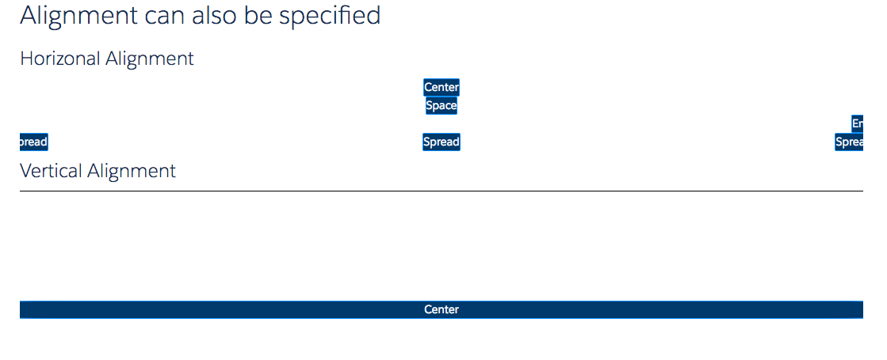
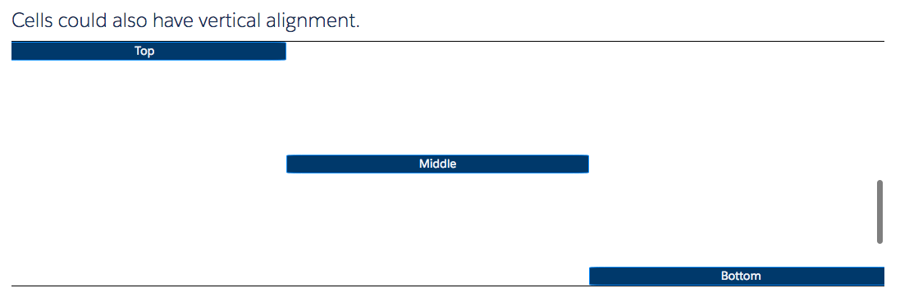
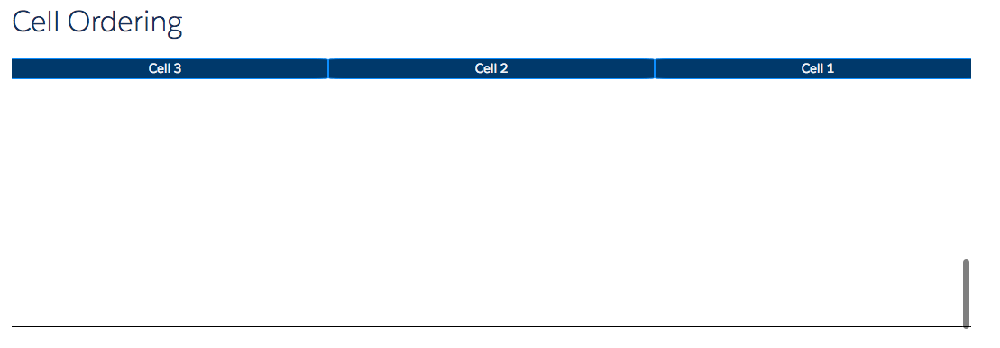

# Grid Column Component

This is the basic LDS Column component. It is used in conjunction with a [ldsc:grid](grid.md) component.

## Attributes
- padding	(String) - Padding between columns. Can be either small, medium or large.
- size - Integer - No of columns that this will consume on normal devices.
- sizeMD - Integer - No of columns that this will consume on medium devices.
- sizeLG - Integer - No of columns that this will consume on large devices.
- columns - Integer - Total no of columns that this will consume on normal devices.
- columnsMD - Integer - Total no of columns that this will consume on medium devices.
- columnsLG - Integer - Total no of columns that this will consume on large devices.
- vertical (String) -	Vertical alignment. Can be top, middle or bottom
- order - Integer - Order of this column
- orderMD - Integer - Order of this column in medium devices
- orderLG - Integer - Order of this column in large devices

## Examples

**Output**









**Component**
```html
<ldsc:lightningDesignApplication >
  <h1 class="slds-text-heading--large">Automatic Sizing</h1>

  <h2 class="slds-text-heading--medium">Normal</h2>
  <ldsc:grid >
      <ldsc:col class="blue">Column 1</ldsc:col>
  	<ldsc:col class="blue">Column 2</ldsc:col>
      <ldsc:col class="blue">Column 3</ldsc:col>
  </ldsc:grid>

  <h2 class="slds-text-heading--medium">Padded</h2>
  <ldsc:grid >
      <ldsc:col class="blue" padding="large">Column 1</ldsc:col>
  	<ldsc:col class="blue" padding="large">Column 2</ldsc:col>
      <ldsc:col class="blue" padding="large">Column 3</ldsc:col>
  </ldsc:grid>

  <h1 class="slds-text-heading--large">Manual Sizing</h1>

  <h2 class="slds-text-heading--medium">Default Columns is 12</h2>
  <ldsc:grid >
      <ldsc:col class="blue" size="2">Column 2 of 12</ldsc:col>
  	<ldsc:col class="blue" size="6">Column 6 of 12</ldsc:col>
      <ldsc:col class="blue" size="4">Column 4 of 12</ldsc:col>
  </ldsc:grid>

  <h2 class="slds-text-heading--medium">Default Columns can be changed</h2>
  <ldsc:grid >
      <ldsc:col class="blue" size="1" columns="5">Column 1 of 5</ldsc:col>
  	<ldsc:col class="blue" size="1" columns="5">Column 1 of 5</ldsc:col>
      <ldsc:col class="blue" size="3" columns="5">Column 3 of 5</ldsc:col>
  </ldsc:grid>

  <h2 class="slds-text-heading--medium">The grid is wrapped by default.</h2>
  <ldsc:grid >
      <ldsc:col class="blue" size="1" columns="5">Column 1 of 5</ldsc:col>
  	<ldsc:col class="blue" size="1" columns="5">Column 1 of 5</ldsc:col>
      <ldsc:col class="blue" size="3" columns="5">Column 3 of 5</ldsc:col>
      <ldsc:col class="blue" size="4" columns="12">Column 4 of 12</ldsc:col>
  	<ldsc:col class="blue" size="6" columns="12">Column 6 of 12</ldsc:col>
      <ldsc:col class="blue" size="2" columns="12">Column 2 of 12</ldsc:col>
  </ldsc:grid>

  <h1 class="slds-text-heading--large">Alignment can also be specified</h1>

  <h2 class="slds-text-heading--medium">Horizonal Alignment</h2>
  <ldsc:grid horizontal="center">
      <ldsc:col class="blue">Center</ldsc:col>
  </ldsc:grid>
  <ldsc:grid horizontal="space">
      <ldsc:col class="blue">Space</ldsc:col>
  </ldsc:grid>
  <ldsc:grid horizontal="end">
      <ldsc:col class="blue">End</ldsc:col>
  </ldsc:grid>
  <ldsc:grid horizontal="spread">
      <ldsc:col class="blue">Spread</ldsc:col>
      <ldsc:col class="blue">Spread</ldsc:col>
      <ldsc:col class="blue">Spread</ldsc:col>
  </ldsc:grid>

  <h2 class="slds-text-heading--medium">Vertical Alignment</h2>
  <ldsc:grid vertical="center" class="border height-300">
      <ldsc:col class="blue">Center</ldsc:col>
  </ldsc:grid>
  <ldsc:grid vertical="stretch" class="border height-300">
      <ldsc:col class="blue">stretch</ldsc:col>
  </ldsc:grid>
  <ldsc:grid vertical="end" class="border height-300">
      <ldsc:col class="blue">End</ldsc:col>
  </ldsc:grid>

  <h2 class="slds-text-heading--medium">Cells could also have vertical alignment.</h2>
  <ldsc:grid class="border height-300">
      <ldsc:col class="blue" vertical="top">Top</ldsc:col>
      <ldsc:col class="blue" vertical="middle">Middle</ldsc:col>
      <ldsc:col class="blue" vertical="bottom">Bottom</ldsc:col>
  </ldsc:grid>

  <h1 class="slds-text-heading--large">Cell Ordering</h1>
  <ldsc:grid class="border height-300">
      <ldsc:col class="blue" order="3">Cell 1</ldsc:col>
      <ldsc:col class="blue" order="2">Cell 2</ldsc:col>
      <ldsc:col class="blue" order="1">Cell 3</ldsc:col>
  </ldsc:grid>
</ldsc:lightningDesignApplication>
```

```css
.THIS .blue {
    text-align: center;
    color: #EEF1F6;
    background-color: #00396B;
    border: 1px solid #0C8EFF;
    border-radius: 5%;
}

.THIS .slds-text-heading--large {
    margin-top: 20px;
    margin-bottom: 20px;
}

.THIS .slds-text-heading--medium {
    margin-top: 10px;
    margin-bottom: 10px;
}

.THIS .border {
    border: 1px solid black;
    margin-bottom: 20px;
}

.THIS .height-300 {
    height: 300px;
}
```
