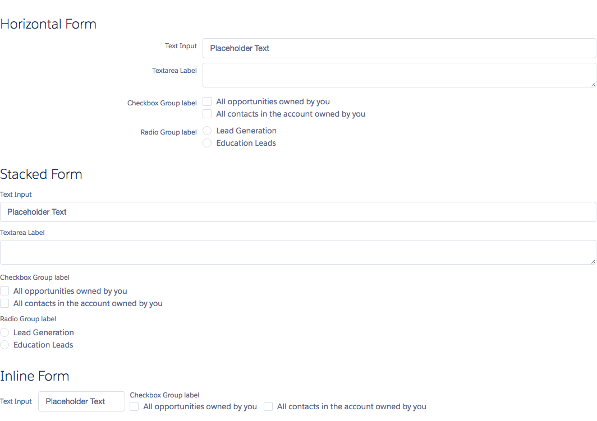

# Form Component

A form element, which is used for form alignment. The type property can be used to set the alignment. The horizontal type has the labels on the side of the input. The stacked type has the labels above the input. The inline type is used to make the inputs be side by side.

## Attributes
- type (String) - The type of form. Can be either horizontal, stacked or inline.

## Example

**Output**


**Component**
```html
<ldsc:lightningDesignApplication>
    <h1 class="slds-text-heading--medium">Horizontal Form</h1>
    <ldsc:form>
        <ldsc:input label="Text Input" placeholder="Placeholder Text" />
        <ldsc:textArea label="Textarea Label" />
        <ldsc:checkboxes groupLabel="Checkbox Group label" labels="All opportunities owned by you,All contacts in the account owned by you" />
        <ldsc:radioButtons name="opts" label="Radio Group label" options="Lead Generation,Education Leads" />
    </ldsc:form>

    <h1 class="slds-text-heading--medium">Stacked Form</h1>
    <ldsc:form type="stacked">
        <ldsc:input label="Text Input" placeholder="Placeholder Text" />
        <ldsc:textArea label="Textarea Label" />
        <ldsc:checkboxes groupLabel="Checkbox Group label" labels="All opportunities owned by you,All contacts in the account owned by you" />
        <ldsc:radioButtons name="opts" label="Radio Group label" options="Lead Generation,Education Leads" />
    </ldsc:form>

    <h1 class="slds-text-heading--medium">Inline Form</h1>
    <ldsc:form type="inline">
        <ldsc:input label="Text Input" placeholder="Placeholder Text" />
        <ldsc:checkboxes groupLabel="Checkbox Group label" labels="All opportunities owned by you,All contacts in the account owned by you" />
    </ldsc:form>
</ldsc:lightningDesignApplication>
```

**Style**
```css
.THIS .slds-text-heading--medium {
    margin-top: 10px;
    margin-bottom: 40px;
}
```
