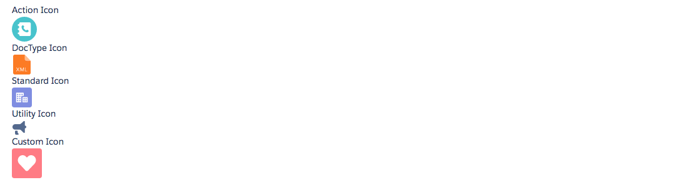

# Icon Component

Icon components can be either used individually or as a part or other components such as cards or buttons. These display an icon, either with or without a container (a span element). There are five kinds of icons - action, custom, doctype, standard or utility. The name of the icon can be taken from the icon names on the [LDS website](http://www.lightningdesignsystem.com/resources/icons/)). The class of the icon can be overridden by providing the class attribute.

## Attributes
- iconType (String) - Can be either action, custom, doctype, standard or utility
- iconName (String) - Must be a name of an icon. E.g add
- iconSize (String) - Size of the icon. Can be small, large, x-small or blank for default
- iconContainer (Boolean) - Should this icon have a container. Default is false
- iconContainerClass (String) - Override the icon container class

## Example

**Output**


**Component**
```html
<ldsc:LightningDesignApplication>
    <div>
        <p>Action Icon</p>
        <ldsc:icon iconType="action" iconName="log_a_call" iconContainer="true" iconSize="small"/>
    </div>
    <div>
        <p>DocType Icon</p>
        <ldsc:icon iconType="doctype" iconName="xml" iconContainer="true" />
    </div>
    <div>
        <p>Standard Icon</p>
        <ldsc:icon iconType="standard" iconName="account" iconContainer="true" />
    </div>
    <div>
        <p>Utility Icon</p>
        <ldsc:icon iconType="utility" iconName="announcement" iconContainer="true" iconSize="small" />
    </div>
    <div>
        <p>Custom Icon</p>
        <ldsc:icon iconType="custom" iconName="custom1" iconContainer="true" class="slds-icon slds-icon--large slds-icon-custom-1"/>
    </div>
</ldsc:LightningDesignApplication>
```
