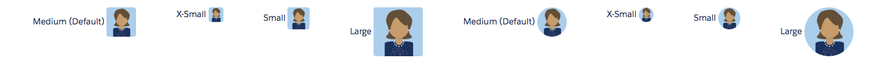

# Image Component

Basic [LDS image component](http://www.lightningdesignsystem.com/components/images/).

## Attributes
- src (String) [Required] - The src attribute of the image (The URL of the image).
- alt (String) [Required] - The alt text attribute of the image.
- size (String) - The size of the image. Can be x-small, small, medium or large. Default is medium.
- circle (Boolean) - Should the image be in a circle?

## Example

**Output**


**Component**
```html
<aura:component access="GLOBAL">
	<ldsc:lightningDesignApplication>
        <ldsc:grid class="margin-left">

            <ldsc:col />

            <ldsc:col>
                Medium (Default)
            	<ldsc:image src="/resource/ldsc__SLDS100/assets/images/avatar2.jpg" alt="Avatar" />
            </ldsc:col>

            <ldsc:col>
                X-Small
            	<ldsc:image src="/resource/ldsc__SLDS100/assets/images/avatar2.jpg" alt="Avatar" size="x-small" />
            </ldsc:col>

            <ldsc:col>
                Small
            	<ldsc:image src="/resource/ldsc__SLDS100/assets/images/avatar2.jpg" alt="Avatar" size="small" />
            </ldsc:col>

            <ldsc:col>
                Large
            	<ldsc:image src="/resource/ldsc__SLDS100/assets/images/avatar2.jpg" alt="Avatar" size="large" />
            </ldsc:col>

            <ldsc:col>
                Medium (Default)
            	<ldsc:image circle="true" src="/resource/ldsc__SLDS100/assets/images/avatar2.jpg" alt="Avatar" />
            </ldsc:col>

            <ldsc:col>
                X-Small
            	<ldsc:image circle="true" src="/resource/ldsc__SLDS100/assets/images/avatar2.jpg" alt="Avatar" size="x-small" />
            </ldsc:col>

            <ldsc:col>
                Small
            	<ldsc:image circle="true" src="/resource/ldsc__SLDS100/assets/images/avatar2.jpg" alt="Avatar" size="small" />
            </ldsc:col>

            <ldsc:col>
                Large
            	<ldsc:image circle="true" src="/resource/ldsc__SLDS100/assets/images/avatar2.jpg" alt="Avatar" size="large" />
            </ldsc:col>
        </ldsc:grid>
    </ldsc:lightningDesignApplication>
</aura:component>
```
