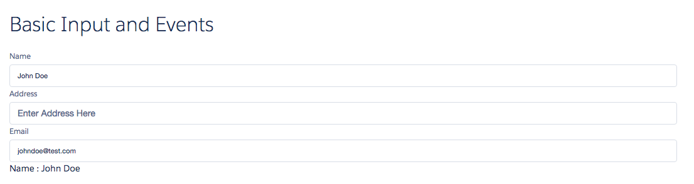
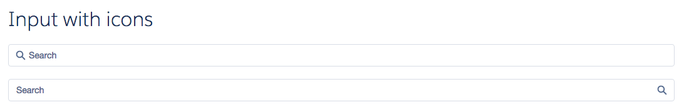
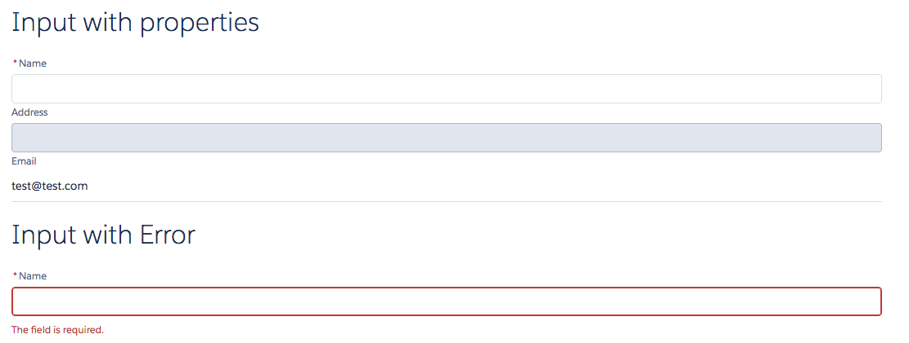

# Input Component

Basic input component in LDS. Consists of an input with a label. The onChange event is fired when the input value is changed (corresponds to the HTML onkeyup event).

## Attributes
- label	(String) - Label of the input control
- placeholder (String) - Placeholder text of the input control
- value (String) - Value of the input control
- type (String) - HTML Type of the input control. Can be text, email, number, date, color, month, week, time, datetime, datetime-local, tel or url
- iconType (String) - Can be either action, custom, doctype, standard or utility.
- iconName (String) - The name of the icon from [LDS](http://www.lightningdesignsystem.com/resources/icons/). This can be ignored if you don't want an icon in the input control.
- iconPosition (String) - Can be either left or right.
- required (Boolean) - Is this field required? Displays a star next to the label. Does not actually perform the validation
- readOnly (Boolean) - Is this field read only?
- disabled (Boolean) - Is this field disabled?
- error (String) - The error message to display. Shows an error below the input box.

## Events
- onChange (ldsc:basicEvent) - Event fired when input element is changed. The event contains a value param with the current value of the input.
- onLostFocus	(ldsc:basicEvent) - Event fired when focus is removed from the input element
- onFocus	(ldsc:basicEvent) - Event fired when input element is selected

## Example

**Output**




**Component**
```html
<aura:component>

  <aura:handler name="init" value="{! this }" action="{! c.init }" />

	<ldsc:LightningDesignApplication >    

        <h1 class="slds-text-heading--large">Basic Input and Events</h1>
        <ldsc:input label="Name" value="{! v.value }" onChange="{! c.onChange }" />
        <ldsc:input label="Address" placeholder="Enter Address Here" />
        <ldsc:input label="Email" type="email" value="{! v.email }" onFocus="{! c.gotFocus }" onLostFocus="{! c.lostFocus }"/>

        <h1>Name : {! v.value }</h1>

        <h1 class="slds-text-heading--large">Input with icons</h1>
        <ldsc:input placeholder="Search" iconName="search" iconType="utility" class="margin-b-20" />
        <ldsc:input placeholder="Search" iconName="search" iconType="utility" iconPosition="right" />

        <h1 class="slds-text-heading--large">Input with properties</h1>
        <ldsc:input label="Name" required="true" />
        <ldsc:input label="Address" disabled="true" />
        <ldsc:input label="Email" readOnly="true" value="test@test.com"/>

        <h1 class="slds-text-heading--large">Input with Error</h1>
        <ldsc:input label="Name" required="true" error="This field is required." />
    </ldsc:LightningDesignApplication>
</aura:component>
```

**Controller**
```js
({
	init : function(component, event, helper) {

        var initialValue = 'John Doe';

		component.set('v.value', initialValue);
        component.set('v.email', initialValue.replace(/ /g, '').toLowerCase() + '@test.com');
	},

    onChange: function(component, event, helper) {

        var newValue = event.getParam('value');

        component.set('v.value', newValue);
        component.set('v.email', newValue.replace(/ /g, '').toLowerCase() + '@test.com');
    },

    gotFocus: function(component, event, helper) {
        console.log('Email element got focus');
    },

    lostFocus: function(component, event, helper) {
        console.log('Email element lost focus');
    }
})
```

**Style**
```css
.THIS .slds-text-heading--large {
    margin-top: 20px;
    margin-bottom: 20px;
}

.THIS .slds-text-heading--medium {
    margin-top: 10px;
    margin-bottom: 10px;
}

.THIS .margin-b-20 {
    margin-bottom: 20px;
}
```
