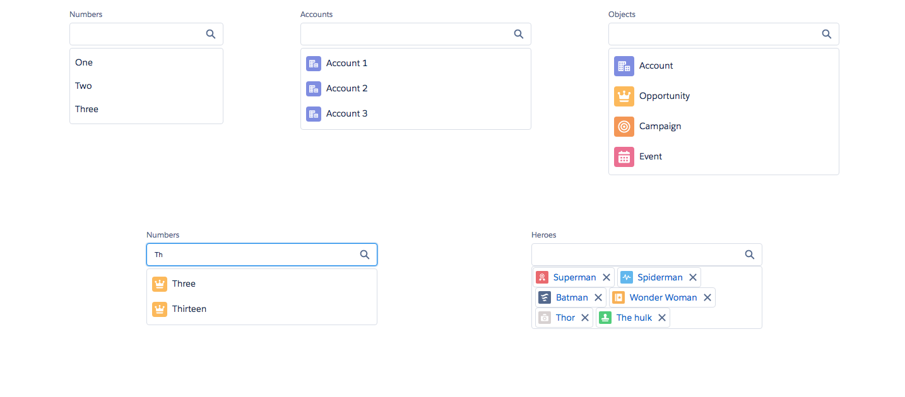

# Lookup Component

Basic input component in LDS. Consists of an input with a label. The onChange event is fired when the input value is changed (corresponds to the HTML onkeyup event).

## Attributes
- label (String) - Label for the Lookup
- searchString (String) - The search string displayed in the input box.
- items (Object[]) - The items to show in the lookup. This can either be a list of strings or a list of objects, each containing a label, iconName, iconType and iconSize.
- selected (Object) - The items which have been selected. This can either be a single string or a single object for a single select lookup or it could be a list of strings or objects for a multi-select lookup.
- defaultIconName	(String) - Name of the icon to show in the left side when it is not provided on the items object.
- defaultIconType	(String) - Type of the icon to show in the left side when it is not provided on the items object.
- defaultIconSize	(String) - Size of the icon to show in the left side when it is not provided on the items object.

## Events
- onChange (ldsc:basicEvent) - Fired when the input (search) is changed. React to this event by filtering the items attribute component. The value attribute contains the latest search string.
- onRemove (ldsc:basicEvent) - Fired when an item is removed from the list. This is called when the close icon is clicked on the pill. Use this to reset the values in the lookup.
- onSelect (ldsc:basicEvent) - Fired when an item is selected in the list. Use this event to add an element to the lookup.

## Example

**Output**


**Component**
```html
<aura:component access="GLOBAL">

    <aura:handler name="init" value="{! this }" action="{! c.init }" />
    <aura:attribute name="listOfObjects" type="Object[]" description="A sample list of objects." access="PRIVATE"/>
    <aura:attribute name="listOfNumbers" type="Object[]" description="A sample list of numbers." access="PRIVATE"/>
    <aura:attribute name="selectedNumber" type="Object" description="The number that was selected." access="PRIVATE"/>

    <aura:attribute name="listOfSuperHeroes" type="Object[]" description="A sample list of numbers." access="PRIVATE"/>
    <aura:attribute name="selectedHeroes" type="Object[]" description="The number that was selected." access="PRIVATE"/>
    <aura:attribute name="herosSearchString" type="String" description="The heroes search string" access="PRIVATE"/>

    <ldsc:LightningDesignApplication >
        <ldsc:grid class="height-320">
            <ldsc:col size="1" />
            <ldsc:col size="2">
                <ldsc:lookup label="Numbers" items="One,Two,Three"/>
            </ldsc:col>
            <ldsc:col size="1" />
            <ldsc:col size="3">
                <ldsc:lookup label="Accounts" items="Account 1,Account 2,Account 3" defaultIconType="standard" defaultIconName="account" />
            </ldsc:col>
            <ldsc:col size="1" />
            <ldsc:col size="3">
                <ldsc:lookup label="Objects" items="{! v.listOfObjects }" />
            </ldsc:col>
            <ldsc:col size="1" />
        </ldsc:grid>
        <ldsc:grid class="height-320">
            <ldsc:col size="1" />
            <ldsc:col size="2">
                <ldsc:lookup label="Numbers" items="{! v.listOfNumbers }" defaultIconType="standard" defaultIconName="opportunity" onChange="{! c.numbersChanged }" onSelect="{! c.numberSelected }" selected="{! v.selectedNumber }" onRemove="{! c.resetSelectedNumber }"/>
            </ldsc:col>
            <ldsc:col size="1" />
            <ldsc:col size="2">
                <ldsc:lookup label="Heroes" items="{! v.listOfSuperHeroes }" searchString="{! v.herosSearchString }" onChange="{! c.heroesFilterChanged }" onSelect="{! c.heroSelected }" selected="{! v.selectedHeroes }" onRemove="{! c.removeHero }"/>
            </ldsc:col>
            <ldsc:col size="1" />
        </ldsc:grid>
    </ldsc:LightningDesignApplication>
</aura:component>
```

**Controller**
```js
({
	init: function(component, event, helper) {
		component.set('v.listOfObjects', helper.getListOfObjects());
	},

  numbersChanged: function(component, event, helper) {
      // Get the search string
      var searchString = event.getParam('value').toLowerCase();

      // Filter the current list of numbers by the search string (use lowercase)
      if (searchString !== '') {
          component.set('v.listOfNumbers', helper.getNumbers().filter(function(num) {
              return num.toLowerCase().startsWith(searchString);
          }));
      } else {
          component.set('v.listOfNumbers', []);
      }
  },

  numberSelected: function(component, event, helper) {
      // Remove the search results by nullifing the list
      component.set('v.listOfNumbers', []);

      // Set the selected number based on the value selected
      component.set('v.selectedNumber', event.getParam('value'));
  },

  resetSelectedNumber: function(component, event, helper) {
      component.set('v.selectedNumber', null);
  },

  heroesFilterChanged: function(component, event, helper) {
      // Get the search string
      var searchString = event.getParam('value').toLowerCase();

      // Filter the current list of heroes by the search string (use lowercase)
      if (searchString !== '') {
          component.set('v.listOfSuperHeroes', helper.getSuperHeroes().filter(function(hero) {
              return hero.label.toLowerCase().startsWith(searchString);
          }));
      } else {
          component.set('v.listOfSuperHeroes', []);
      }
  },

  heroSelected: function(component, event, helper) {

      // Nullify the search string
      // Hack to nulify
      component.set('v.herosSearchString', event.getParam('value'));
      component.set('v.herosSearchString', '');
      // Remove the search box
      component.set('v.listOfSuperHeroes', []);

      // Find the hero which was selected
      var selectedHero = helper.getSuperHeroes().filter(function(hero) {
          return hero.label == event.getParam('value');
      })[0];

      // Get the current selection of heroes
      var currentSelection = component.get('v.selectedHeroes');

      // Append the heroes to the current selection
      component.set('v.selectedHeroes', currentSelection.concat(selectedHero));
  },

  removeHero: function(component, event, helper) {
      // Get current selection of heroes
      var currentSelection = component.get('v.selectedHeroes');

      // Remove the hero by filtering the list
      component.set('v.selectedHeroes', currentSelection.filter(function(hero) {
          return hero.label != event.getParam('value');
      }));
  }
})
```

**Helper**
```js
({
	getListOfObjects: function() {
        return [
            {
                label: 'Account',
                iconType: 'standard',
                iconName: 'account'
            },
            {
                label: 'Opportunity',
                iconType: 'standard',
                iconName: 'opportunity'
            },
            {
                label: 'Campaign',
                iconType: 'standard',
                iconName: 'campaign'
            },
            {
                label: 'Event',
                iconType: 'standard',
                iconName: 'event'
            }
        ];
	},

  getNumbers: function() {
      return [
      	'One',
          'Two',
          'Three',
          'Four',
          'Five',
          'Six',
          'Seven',
          'Eight',
          'Nine',
          'Ten',
          'Eleven',
          'Twelve',
          'Thirteen',
          'Fourteen',
          'Fifteen',
          'Sixteen',
          'Seventeen',
          'Eighteen',
          'Nineteen',
          'Twenty'
      ];
  },

  getSuperHeroes: function() {
      return [
          {
              label: 'Superman',
              iconName: 'reward',
              iconType: 'standard'
          },
          {
              label: 'Batman',
              iconName: 'flow',
              iconType: 'standard'
          },
          {
              label: 'Spiderman',
              iconName: 'feed',
              iconType: 'standard'
          },
          {
              label: 'Wonder Woman',
              iconName: 'performance',
              iconType: 'standard'
          },
          {
              label: 'Ironman',
              iconName: 'dashboard',
              iconType: 'standard'
          },
          {
              label: 'The hulk',
              iconName: 'approval',
              iconType: 'standard'
          },
          {
              label: 'Thor',
              iconName: 'photo',
              iconType: 'standard'
          },
          {
              label: 'Captain America',
              iconName: 'today',
              iconType: 'standard'
          },
          {
              label: 'Elektra',
              iconName: 'work_order_item',
              iconType: 'standard'
          },
          {
              label: 'Catwoman',
              iconName: 'topic',
              iconType: 'standard'
          },
          {
              label: 'Deadpool',
              iconName: 'article',
              iconType: 'standard'
          }
      ];
  }
})
```

**Style**
```css
.THIS .height-320 {
    height: 320px;
}
```
