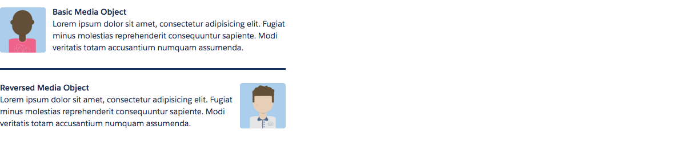

# Media Component

When you need text and a figure next to each other, use a [media object](http://www.lightningdesignsystem.com/components/media-objects/).

## Attributes
- figure (Component[]) - Figure facet
- center (Boolean) - Should the body be centered?
- responsive (Boolean) - Should it be responsive?
- figureReverse	(Component[]) -	Reverse figure facet

## Examples

**Output**



**Component**
```html
<aura:component access="GLOBAL">
	<ldsc:lightningDesignApplication>
        <div class="reduce-width">
            <ldsc:media>
                <aura:set attribute="figure">
                    <ldsc:image src="/resource/ldsc__SLDS100/assets/images/avatar3.jpg" size="large" alt="Avatar" />
                </aura:set>
                <h1 class="bold">Basic Media Object</h1>
                <p>Lorem ipsum dolor sit amet, consectetur adipisicing elit. Fugiat minus molestias reprehenderit consequuntur sapiente. Modi veritatis totam accusantium numquam assumenda.</p>
            </ldsc:media>

            <div class="divider"></div>

            <ldsc:media>
                <aura:set attribute="figureReverse">
                    <ldsc:image src="/resource/ldsc__SLDS100/assets/images/avatar1.jpg" size="large" alt="Avatar" />
                </aura:set>
                <h1 class="bold">Reversed Media Object</h1>
                <p>Lorem ipsum dolor sit amet, consectetur adipisicing elit. Fugiat minus molestias reprehenderit consequuntur sapiente. Modi veritatis totam accusantium numquam assumenda.</p>
            </ldsc:media>
        </div>
    </ldsc:lightningDesignApplication>
</aura:component>
```

**Style**
```css
.THIS .reduce-width {
    width: 500px;
}

.THIS .divider {
    border-top: 4px solid #16325c;
    margin-top: 25px;
    height: 25px;
}

.THIS .bold {
    font-weight: bold;
}
```
