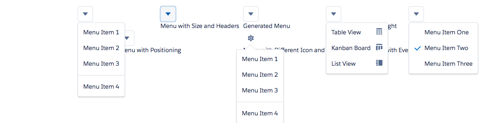

# Menu Component (Includes menuItem, menuHeader and menuSeperator)

A [Menu](http://www.lightningdesignsystem.com/components/menus/) offers a list of actions or functions that a user can access. The menu consists of an icon and a menu which is shown only when the user clicks on an icon. A menu is usually used in conjunction with a menuItem, a menuHeader and a menuSeperator. Each of these components could be children of a menu component which then become a part of the menu items. A menu can be auto generated by suppling an array of strings to the items attribute. The icon of a menu can also be changed by suppling the icon attributes such as iconName and iconType. The positioning of a menu around the icon can also be specified by using the positionVertical and positionHorizontal attributes. The onClick event is invoked when someone clicks on a menu item and the name of the item is passed as the value param in the event.

## Attributes of Menu
- iconType (String)	- Can be either action, custom, doctype, standard or utility (Inherited from ldsc:IconAttributes)
- iconName (String)	- Must be a name of an icon. E.g add (Inherited from ldsc:IconAttributes)
- iconSize (String) - Size of the icon. Can be small, large, x-small or blank for default (Inherited from ldsc:IconAttributes)
- iconClass (String) - Class to be added to the icon. (Inherited from ldsc:IconAttributes)
- iconContainer (Boolean) - Should this icon have a container (Inherited from ldsc:IconAttributes)
- iconContainerClass (String) - Override the class of the container
- show (Boolean) - Should the menu be shown?
- size (String) - Size can be either blank (stretch), small, medium or large. Default is blank
- positionHorizontal (String) - Can be left, blank or right. Default is left.
- positionVertical (String) - Can be top or bottom. Default is top.
- nubbin (Boolean) - Should a nubbin be shown.
- items (object[]) - The list of items in the menu. Pass a -- into the string to indicate a separator.
- buttonClass (String) - Class to be added to the button.

## Events of Menu
- onClick	(ldsc:basicEvent) - Called when a menu item is clicked.

A Menu Header is a sub header in a menu and can consist of one or more menu items. Use this component when you want to separate out your menu items into categories. The menu header consists of a label attribute which holds the label of the menu item.

## Attributes of Menu Header
- label (String)	- Label of the Menu Sub Header

## Events of Menu Header
- onClick	(ldsc:basicEvent) - Called when a menu item is clicked.

A Menu Item is a child of a menu or a menuHeader and can contains a label attribute which is the name of the item. A menu item can also contain a icon to the left or to the right.

## Attributes of Menu Item
- label (String) - Label of the menu item.
- leftIconSelected (Boolean) - Is the left icon selected? The left icon is usually used to indicate selected or not selected.
- leftIconType (String) - Left icon type. Can be either action, custom, doctype, standard or utility
- leftIconName (String) - Left icon name. Must be a name of an icon. E.g add
- rightIconType (String) - Right icon type. Can be either action, custom, doctype, standard or utility
- rightIconName (String) - Right icon name. Must be a name of an icon. E.g add

## Events of Menu Item
- onClick	(ldsc:basicEvent) - Called when a menu item is clicked.

A Menu Separator is a separator element in a menu and is used to separate out multiple menu items. It can be a child of a menu or a menuHeader.

## Attributes of Menu Separator
N/A

## Events of Menu Separator
N/A

## Example

**Output**


**Component**
```html
<aura:component access="GLOBAL">

    <aura:attribute name="menuItem" type="String" default="" description="The name of the menu item which is selected" access="GLOBAL" />

    <ldsc:grid>
        <ldsc:col size="2" />
        <ldsc:col size="2">
            <ldsc:menu >
                <ldsc:menuItem label="Menu Item 1" />
                <ldsc:menuItem label="Menu Item 2" />
                <ldsc:menuItem label="Menu Item 3" />
                <ldsc:menuSeparator />
                <ldsc:menuItem label="Menu Item 4" />
            </ldsc:menu>
            <div>
                <h1>Simple Menu</h1>
            </div>
        </ldsc:col>

        <ldsc:col size="2">
            <ldsc:menu size="large">
                <ldsc:menuHeader label="Sub Menu 1">
                    <ldsc:menuItem label="Menu Item 1" />
                    <ldsc:menuItem label="Menu Item 2" />
                    <ldsc:menuItem label="Menu Item 3" />
                </ldsc:menuHeader>
                <ldsc:menuHeader label="Sub Menu 2">
                    <ldsc:menuItem label="Menu Item 4" />
                    <ldsc:menuItem label="Menu Item 5" />
                    <ldsc:menuSeparator />
                    <ldsc:menuItem label="Menu Item 6" />
                </ldsc:menuHeader>
            </ldsc:menu>
            <div>
                <h1>Menu with Size and Headers</h1>
            </div>
        </ldsc:col>

        <ldsc:col size="2">    
            <ldsc:menu items="File,Save,Save As,--,Exit" />
            <div>
                <h1>Generated Menu</h1>
            </div>
        </ldsc:col>

        <ldsc:col size="2">   
            <ldsc:menu >
                <ldsc:menuItem label="Table View" rightIconType="utility" rightIconName="table" />
                <ldsc:menuItem label="Kanban Board" rightIconType="utility" rightIconName="kanban" />
                <ldsc:menuItem label="List View" rightIconType="utility" rightIconName="side_list" />
            </ldsc:menu>
            <div>
                <h1>Menu with Icons on Right</h1>
            </div>
        </ldsc:col>

        <ldsc:col size="2">
            <ldsc:menu >
                <ldsc:menuItem label="Menu Item One" leftIconType="utility" leftIconName="check" />
                <ldsc:menuItem label="Menu Item Two" leftIconType="utility" leftIconName="check" leftIconSelected="true" />
                <ldsc:menuItem label="Menu Item Three" leftIconType="utility" leftIconName="check" />
            </ldsc:menu>
            <div>
                <h1>Menu with Icons on Left</h1>
            </div>
        </ldsc:col>

        <ldsc:col size="2" />

        <ldsc:col size="2">
            <ldsc:menu positionVertical="bottom" positionHorizontal="right">
                <ldsc:menuItem label="Menu Item 1" />
                <ldsc:menuItem label="Menu Item 2" />
                <ldsc:menuItem label="Menu Item 3" />
                <ldsc:menuSeparator />
                <ldsc:menuItem label="Menu Item 4" />
            </ldsc:menu>
            <div>
                <h1>Menu with Positioning</h1>
            </div>
        </ldsc:col>

        <ldsc:col size="2">
            <ldsc:menu nubbin="true" iconType="utility" iconName="settings" buttonClass="slds-button slds-button--icon-container">
                <ldsc:menuItem label="Menu Item 1" />
                <ldsc:menuItem label="Menu Item 2" />
                <ldsc:menuItem label="Menu Item 3" />
                <ldsc:menuSeparator />
                <ldsc:menuItem label="Menu Item 4" />
            </ldsc:menu>
            <div>
                <h1>Menu with Different Icon and Nubbin</h1>
            </div>
        </ldsc:col>

        <ldsc:col size="2">  
            <ldsc:menu onClick="{! c.menuItemClicked }">
                <ldsc:menuItem label="Menu Item 1" />
                <ldsc:menuItem label="Menu Item 2" />
                <ldsc:menuItem label="Menu Item 3" />
                <ldsc:menuSeparator />
                <ldsc:menuItem label="Menu Item 4" />
            </ldsc:menu>
            <div>
                <h1>Menu with Event</h1>
                <aura:if isTrue="{! v.menuItem != ''}">
                    <p>{! v.menuItem } was clicked</p>
                </aura:if>
            </div>
        </ldsc:col>
    </ldsc:grid>
</aura:component>
```

**Controller**
```js
({
	menuItemClicked : function(component, event, helper) {
		component.set('v.menuItem', event.getParam('value'));
	}
})
```
