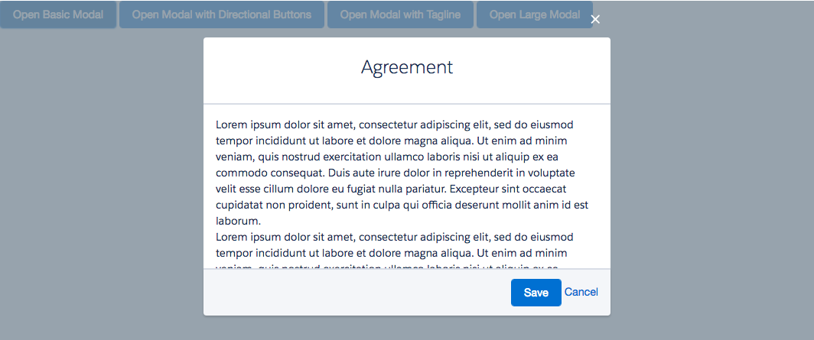

# Spinner Component

This component shows a modal on the screen. The show attribute is used to decide whether the modal should be shown or not.

## Attributes
- show (Boolean) - Should the modal be shown?
- header (String) - The text of the modal header
- footer (Component[]) - The components of the footer
- tagline (Component[]) - A tagline to show just below the header.
- size (String) - Size of the modal. Can be either default or large.
- directionalFooter (Boolean) - Should the footer be directional. I.e the buttons will be split, one on the left and the other on the right.

## Examples

**Output**

### Basic Modal


### Modal with Directional Buttons


### Modal with Tagline


### Large Modal


**Component**
```html
<ldsc:lightningDesignApplication>

    <ldsc:button theme="brand" onClick="{! c.showBasicModal }">Open Basic Modal</ldsc:button>
    <ldsc:button theme="brand" onClick="{! c.showDirectionalModal }">Open Modal with Directional Buttons</ldsc:button>
    <ldsc:button theme="brand" onClick="{! c.showTaglineModal }">Open Modal with Tagline</ldsc:button>
    <ldsc:button theme="brand" onClick="{! c.showLargeModal }">Open Large Modal</ldsc:button>

  <ldsc:modal header="Agreement" show="{! v.showBasic }">
        <p>Lorem ipsum dolor sit amet, consectetur adipiscing elit, sed do eiusmod tempor incididunt ut labore et dolore magna aliqua. Ut enim ad minim veniam, quis nostrud exercitation ullamco laboris nisi ut aliquip ex ea commodo consequat. Duis aute irure dolor in reprehenderit in voluptate velit esse cillum dolore eu fugiat nulla pariatur. Excepteur sint occaecat cupidatat non proident, sunt in culpa qui officia deserunt mollit anim id est laborum.</p>
        <p>Lorem ipsum dolor sit amet, consectetur adipiscing elit, sed do eiusmod tempor incididunt ut labore et dolore magna aliqua. Ut enim ad minim veniam, quis nostrud exercitation ullamco laboris nisi ut aliquip ex ea commodo consequat. Duis aute irure dolor in reprehenderit in voluptate velit esse cillum dolore eu fugiat nulla pariatur. Excepteur sint occaecat cupidatat non proident, sunt in culpa qui officia deserunt mollit anim id est laborum.</p>
        <aura:set attribute="footer">
            <ldsc:button theme="brand">Save</ldsc:button>
            <ldsc:button >Cancel</ldsc:button>
        </aura:set>
    </ldsc:modal>

    <ldsc:modal header="Agreement" show="{! v.showDirectional }" directionalFooter="true">
        <p>Look the buttons are on each side</p>
        <p>Lorem ipsum dolor sit amet, consectetur adipiscing elit, sed do eiusmod tempor incididunt ut labore et dolore magna aliqua. Ut enim ad minim veniam, quis nostrud exercitation ullamco laboris nisi ut aliquip ex ea commodo consequat. Duis aute irure dolor in reprehenderit in voluptate velit esse cillum dolore eu fugiat nulla pariatur. Excepteur sint occaecat cupidatat non proident, sunt in culpa qui officia deserunt mollit anim id est laborum.</p>
        <aura:set attribute="footer">
            <ldsc:button theme="brand">Left</ldsc:button>
            <ldsc:button theme="brand">Right</ldsc:button>
        </aura:set>
    </ldsc:modal>

    <ldsc:modal header="Agreement" show="{! v.showTagline }">
        <p>Lorem ipsum dolor sit amet, consectetur adipiscing elit, sed do eiusmod tempor incididunt ut labore et dolore magna aliqua. Ut enim ad minim veniam, quis nostrud exercitation ullamco laboris nisi ut aliquip ex ea commodo consequat. Duis aute irure dolor in reprehenderit in voluptate velit esse cillum dolore eu fugiat nulla pariatur. Excepteur sint occaecat cupidatat non proident, sunt in culpa qui officia deserunt mollit anim id est laborum.</p>
        <p>Lorem ipsum dolor sit amet, consectetur adipiscing elit, sed do eiusmod tempor incididunt ut labore et dolore magna aliqua. Ut enim ad minim veniam, quis nostrud exercitation ullamco laboris nisi ut aliquip ex ea commodo consequat. Duis aute irure dolor in reprehenderit in voluptate velit esse cillum dolore eu fugiat nulla pariatur. Excepteur sint occaecat cupidatat non proident, sunt in culpa qui officia deserunt mollit anim id est laborum.</p>
        <aura:set attribute="tagline">
            Here’s a tagline if you need it. It is allowed to extend across mulitple lines, so I’m making up content to show that to you. It is allowed to <a href="#">contain links or be a link</a>.
        </aura:set>
        <aura:set attribute="footer">
            <ldsc:button theme="brand">Save</ldsc:button>
            <ldsc:button >Cancel</ldsc:button>
        </aura:set>
    </ldsc:modal>

    <ldsc:modal header="Agreement" show="{! v.showLarge }" size="large">
        <p>Lorem ipsum dolor sit amet, consectetur adipiscing elit, sed do eiusmod tempor incididunt ut labore et dolore magna aliqua. Ut enim ad minim veniam, quis nostrud exercitation ullamco laboris nisi ut aliquip ex ea commodo consequat. Duis aute irure dolor in reprehenderit in voluptate velit esse cillum dolore eu fugiat nulla pariatur. Excepteur sint occaecat cupidatat non proident, sunt in culpa qui officia deserunt mollit anim id est laborum.</p>
        <p>Lorem ipsum dolor sit amet, consectetur adipiscing elit, sed do eiusmod tempor incididunt ut labore et dolore magna aliqua. Ut enim ad minim veniam, quis nostrud exercitation ullamco laboris nisi ut aliquip ex ea commodo consequat. Duis aute irure dolor in reprehenderit in voluptate velit esse cillum dolore eu fugiat nulla pariatur. Excepteur sint occaecat cupidatat non proident, sunt in culpa qui officia deserunt mollit anim id est laborum.</p>
        <aura:set attribute="footer">
            <ldsc:button theme="brand">Save</ldsc:button>
            <ldsc:button >Cancel</ldsc:button>
        </aura:set>
    </ldsc:modal>
</ldsc:lightningDesignApplication>
```

```js
({
	showBasicModal : function(component, event, helper) {
		var currentState = component.get('v.showBasic');
        if (currentState) {
            component.set('v.showBasic', false);
        } else {
            component.set('v.showBasic', true);
        }
	},

    showDirectionalModal : function(component, event, helper) {
		var currentState = component.get('v.showDirectional');
        if (currentState) {
            component.set('v.showDirectional', false);
        } else {
            component.set('v.showDirectional', true);
        }
	},

    showTaglineModal : function(component, event, helper) {
		var currentState = component.get('v.showTagline');
        if (currentState) {
            component.set('v.showTagline', false);
        } else {
            component.set('v.showTagline', true);
        }
	},

    showLargeModal : function(component, event, helper) {
		var currentState = component.get('v.showLarge');
        if (currentState) {
            component.set('v.showLarge', false);
        } else {
            component.set('v.showLarge', true);
        }
	}

})
```
