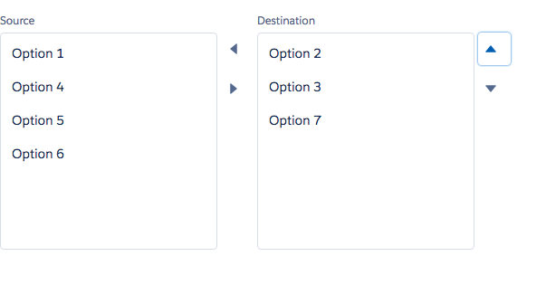

# Multi-Select Component

Multi-Select component in [LDS](http://www.lightningdesignsystem.com/components/forms/#multi-select). Consists of two side by side components which contain the list of options and the list of selections. The two sections can have a label (category).

## Attributes
- sourceCategory (String) - The first category header.
- destCategory (String) - The second category header.
- options	(String[]) - The list of options
- selected (String[]) - The list of selected options

## Events
- onChange (ldsc:basicEvent) - onChange	ldsc:basicEvent	Called when the selection is changed. The value param of the event is an object containing the options and the selection which are both arrays.

## Example

**Output**


**Component**
```html
<aura:component>
  <aura:attribute name="options" type="String[]" default="Option 1,Option 2,Option 3,Option 4,Option 5,Option 6,Option 7" access="GLOBAL" />
  <aura:attribute name="selectedValues" type="String[]" access="GLOBAL" />

  <ldsc:LightningDesignApplication >
      <ldsc:multiSelect sourceCategory="Source" destCategory="Destination" options="{! v.options }" selected="{! v.selectedValues }" onChange="{! c.selectionChanged }" />
  </ldsc:LightningDesignApplication>

</aura:component>
```

**Controller**
```js
({
  selectionChanged : function(component, event, helper) {
    var values = event.getParam('value');
    component.set('v.options', values.options);
    component.set('v.selectedValues', values.selected);
  }
})
```
