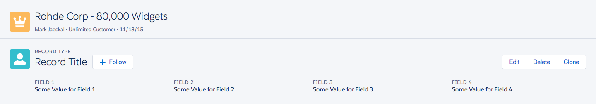

# Page Header Component

[Page headers](http://www.lightningdesignsystem.com/components/page-headers/) are used at the top of several page types. The body of the page header component will contain the detail information at the bottom of the header.

## Attributes
title	(String) - Title of the header
subTitleTop (String) - Sub-Title of the header before the header.
subTitleBottom (String) - Sub-Title of the header after the header.
buttonsFacet (Component[]) - The buttons facet next to the header
actionsFacet (Component[]) - The actions facet on the right hand side of the header.
iconType (String) - Can be either action, custom, doctype, standard or utility. Default is standard.
iconName (String) - Must be a name of an icon. E.g add
iconSize (String)	- Size of the icon. Can be small, large, x-small or blank for default. Default is large.
iconContainer	(Boolean)	- Should this icon have a container
iconContainerClass (String) - Override the class of the container

## Example

**Output**


**Component**
```html
<aura:component access="GLOBAL">
    <ldsc:pageHeader title="Rohde Corp - 80,000 Widgets" subTitleBottom="Mark Jaeckal • Unlimited Customer • 11/13/15" iconName="opportunity" />
    <ldsc:pageHeader title="Record Title" subTitleTop="Record Type" iconName="user">
        <aura:set attribute="buttonsFacet">
            <ldsc:button iconType="utility" iconName="add" theme="neutral">Follow</ldsc:button>
        </aura:set>
        <aura:set attribute="actionsFacet">
            <ldsc:buttonGroup>
                <ldsc:button theme="neutral">Edit</ldsc:button>
                <ldsc:button theme="neutral">Delete</ldsc:button>
                <ldsc:button theme="neutral">Clone</ldsc:button>
            </ldsc:buttonGroup>
        </aura:set>
        <ul class="slds-grid slds-page-header__detail-row">
            <li class="slds-col--padded slds-size--1-of-4">
                <p class="slds-text-heading--label slds-truncate" title="Field 1">Field 1</p>
                <p class="slds-text-body--regular slds-truncate" title="Some Value for Field 1">Some Value for Field 1</p>
            </li>
            <li class="slds-col--padded slds-size--1-of-4">
                <p class="slds-text-heading--label slds-truncate" title="Field 1">Field 2</p>
                <p class="slds-text-body--regular slds-truncate" title="Some Value for Field 2">Some Value for Field 2</p>
            </li>
            <li class="slds-col--padded slds-size--1-of-4">
                <p class="slds-text-heading--label slds-truncate" title="Field 1">Field 3</p>
                <p class="slds-text-body--regular slds-truncate" title="Some Value for Field 3">Some Value for Field 3</p>
            </li>
            <li class="slds-col--padded slds-size--1-of-4">
                <p class="slds-text-heading--label slds-truncate" title="Field 1">Field 4</p>
                <p class="slds-text-body--regular slds-truncate" title="Some Value for Field 4">Some Value for Field 4</p>
            </li>
        </ul>
    </ldsc:pageHeader>
</aura:component>
```
