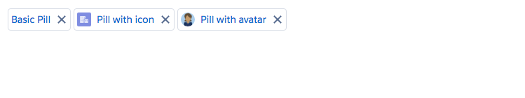

# Pill Component

Within a form control, a pill represents an existing item in a database, as opposed to user-generated freeform text. A pill triggers a onRemove event when the close button is clicked. A pill can have an icon or a avatar.

## Attributes
- label (String) - Label of pill
- avatarURL (String) - URL of the Avatar

## Events
- onRemove (ldsc:basicEvent) - Event called when the pill is removed

## Example

**Output**


**Component**
```html
<ldsc:lightningDesignApplication>
    <ldsc:pill label="Basic Pill" onRemove="{! c.removePill }" />
    <ldsc:pill label="Pill with icon" iconType="standard" iconName="account" onRemove="{! c.removePill }" />
    <ldsc:pill label="Pill with avatar" avatarURL="/resource/ldsc__SLDS100/assets/images/avatar2.jpg" onRemove="{! c.removePill }" />
</ldsc:lightningDesignApplication>
```

**Controller**
```js
({
	removePill : function(component, event, helper) {
		console.log(event.getSource().get('v.label'), 'was removed');
	}
})
```
