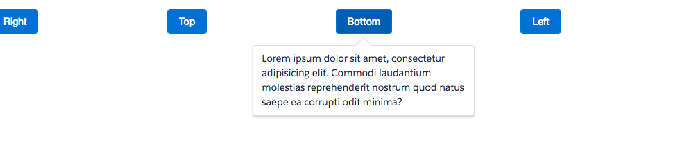

# Popover Component

A [popover](http://www.lightningdesignsystem.com/components/popovers/) is a non-modal dialog. The popover element is attached to a trigger element which displays the popover when the trigger event occurs. The popover is hidden until the eventStop event occurs on the triggerStop element.

## Attributes

- triggerElement (String) [Required] - Show popup based on which element?
- triggerEvent (String) - Show popup based on which event on selected element? Default is mouseover.
- triggerStopElement (String) - Hide popup based on which element? Defaults to triggerElement
- triggerStopEvent (String) - Hide popup based on which event on selected element? Default is mouseout.
- theme	(String) - Theme of the popover. Can be either blank, info, error, warning or success. Default is blank.
- position (String) - Position of the popup. Default is right.
- show (Boolean) - Should the popup be shown? Defaults to false.

## Example

**Output**



**Component**
```html
<aura:component access="GLOBAL">
    <ldsc:lightningDesignApplication>
        <ldsc:grid>
            <ldsc:col>
                <ldsc:button id="buttonRight" theme="brand">Right</ldsc:button>
            </ldsc:col>
            <ldsc:col>
                <ldsc:button id="buttonTop" theme="brand">Top</ldsc:button>
            </ldsc:col>
            <ldsc:col>
                <ldsc:button id="buttonBottom" theme="brand">Bottom</ldsc:button>
            </ldsc:col>
            <ldsc:col>
                <ldsc:button id="buttonLeft" theme="brand">Left</ldsc:button>
            </ldsc:col>
        </ldsc:grid>

        <ldsc:popover triggerElement="#buttonRight">
            <p>Lorem ipsum dolor sit amet, consectetur adipisicing elit. Commodi laudantium molestias reprehenderit nostrum quod natus saepe ea corrupti odit minima?</p>
        </ldsc:popover>
        <ldsc:popover triggerElement="#buttonTop" position="top" theme="info">
            <p>Lorem ipsum dolor sit amet, consectetur adipisicing elit. Commodi laudantium molestias reprehenderit nostrum quod natus saepe ea corrupti odit minima?</p>
        </ldsc:popover>
        <ldsc:popover triggerElement="#buttonBottom" position="bottom">
            <p>Lorem ipsum dolor sit amet, consectetur adipisicing elit. Commodi laudantium molestias reprehenderit nostrum quod natus saepe ea corrupti odit minima?</p>
        </ldsc:popover>
        <ldsc:popover triggerElement="#buttonLeft" triggerEvent="click" triggerStopElement="body" triggerStopEvent="click" position="left" theme="error">
            <p>Lorem ipsum dolor sit amet, consectetur adipisicing elit. Commodi laudantium molestias reprehenderit nostrum quod natus saepe ea corrupti odit minima?</p>
        </ldsc:popover>
    </ldsc:lightningDesignApplication>
</aura:component>
```
