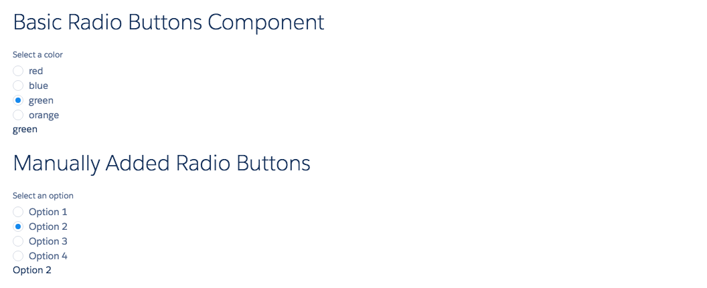
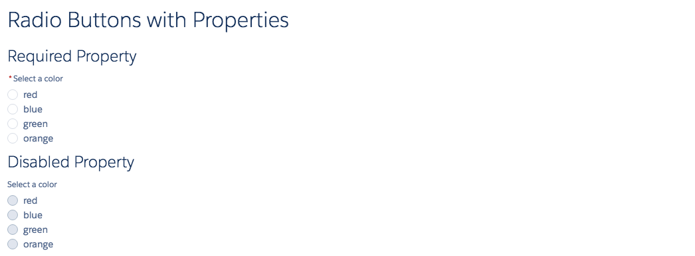
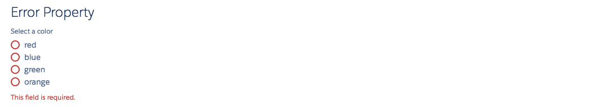

# Radio Buttons Component

Radio Buttons component in LDS. This includes ldsc:radioButton and ldsc:radioButtons. ldsc:radioButtons is the parent component and may contain zero or more <ldsc:radioButton>'s. You can either manually create child ldsc:radioButton components or automatically create them using the options attribute. The options attribute is a list of strings, each of which would be used to create a child radio button. The name attribute is required and is used as the name of the radioButton group. The label attribute will be used as the title for the radio buttons.

## Attributes of ldsc:radioButtons
- name (String)[Required] - Name of the radiobutton set. Must be unique for a group of radio buttons.
- label	(String) - Label for radio buttons
- options (String[]) - List of options to be shown. This is a string array containing a list of options.
- value (String) - Selected Option
- required (Boolean) - Is this field required? Displays a star next to the label. Does not actually perform the validation
- readOnly (Boolean) - Is this field read only?
- disabled (Boolean) - Is this field disabled?
- error (String) - The error message.

## Events of ldsc:radioButtons
- onChange (ldsc:basicEvent) - Event fired when radio button is changed. The event contains a value param with the label of the radio button which is selected.

## Attributes of ldsc:radioButton
- name (String) - Name of the radiobutton set. Must be unique for a group of radio buttons.
- label (String) - The label of the option
- selected (Boolean) - Should this option be checked
- disabled (Boolean) - Is this field disabled?

## Events of ldsc:radioButton
- onChange (ldsc:basicEvent) - Event fired when radio button is changed.

## Example

**Output**




**Component**
```html
<aura:component>

  <aura:handler name="init" value="{! this }" action="{! c.init }" />

  <aura:attribute name="selectedColor" type="String" description="The selected color." access="PRIVATE" />
  <aura:attribute name="selectedOption" type="String" description="The selected option." access="PRIVATE" />

  <ldsc:LightningDesignApplication >

        <h1 class="slds-text-heading--large">Basic Radio Buttons Component</h1>

        <ldsc:radioButtons name="color" label="Select a color" options="red,blue,green,orange" value="{! v.selectedColor }" onChange="{! c.onSelectColor }"/>
        <h1>{! v.selectedColor }</h1>

        <h1 class="slds-text-heading--large">Manually Added Radio Buttons</h1>

        <ldsc:radioButtons name="opts" label="Select an option" onChange="{! c.onSelectManualOption }" value="{! v.selectedOption }">
            <ldsc:radioButton label="Option 1" />
            <ldsc:radioButton label="Option 2" />
            <ldsc:radioButton label="Option 3" />
            <ldsc:radioButton label="Option 4" />
        </ldsc:radioButtons>

        <h1>{! v.selectedOption }</h1>

        <h1 class="slds-text-heading--large">Radio Buttons with Properties</h1>

        <h2 class="slds-text-heading--medium">Required Property</h2>
        <ldsc:radioButtons name="color" label="Select a color" options="red,blue,green,orange" required="true"/>

        <h2 class="slds-text-heading--medium">Disabled Property</h2>
        <ldsc:radioButtons name="color" label="Select a color" options="red,blue,green,orange" disabled="true"/>

        <h2 class="slds-text-heading--medium">Error Property</h2>
        <ldsc:radioButtons name="color" label="Select a color" options="red,blue,green,orange" error="This field is required."/>


    </ldsc:LightningDesignApplication>
</aura:component>
```

**Controller**
```js
({
  init : function(component, event, helper) {
    component.set('v.selectedColor', 'green');
    component.set('v.selectedOption', 'Option 2');
  },

  onSelectColor: function(component, event, helper) {
    component.set('v.selectedColor', event.getParam('value'));
  },

  onSelectManualOption: function(component, event, helper) {
    component.set('v.selectedOption', event.getParam('value'));
  }
})
```

**Style**
```css
.THIS .slds-text-heading--large {
    margin-top: 20px;
    margin-bottom: 20px;
}

.THIS .slds-text-heading--medium {
    margin-top: 10px;
    margin-bottom: 10px;
}
```
