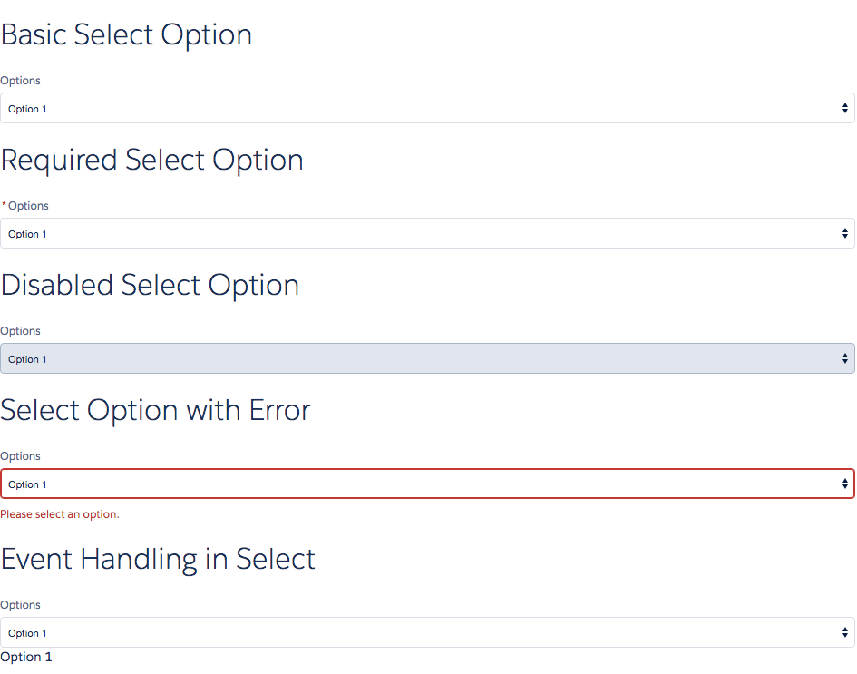

# Select Component

Basic select component in LDS. Contains an options attribute which is a list of options to be shown.

## Attributes
- label (String) - Label for the select option
- options (String[]) - The list of options
- value (String) - The selected option
- required (Boolean) - Is this field required?
- disabled (Boolean) - Is this field required?
- error (String) - Error to be displayed

## Events
- onChange (ldsc:basicEvent) - Called when select option is changed. The value parameter contains the changed attribute.

## Example

**Output**


**Component**
```html
<aura:component>

    <aura:attribute name="selectedOption" type="String" default="Option 2" description="The Selected option." access="GLOBAL"/>

    <ldsc:lightningDesignApplication>
        <h1 class="slds-text-heading--large">Basic Select Option</h1>
        <ldsc:select label="Options" options="Option 1,Option 2,Option 3" />

        <h1 class="slds-text-heading--large">Required Select Option</h1>
        <ldsc:select label="Options" options="Option 1,Option 2,Option 3" required="true" />

        <h1 class="slds-text-heading--large">Disabled Select Option</h1>
        <ldsc:select label="Options" options="Option 1,Option 2,Option 3" disabled="true" />

        <h1 class="slds-text-heading--large">Select Option with Error</h1>
        <ldsc:select label="Options" options="Option 1,Option 2,Option 3" error="Please select an option." />

        <h1 class="slds-text-heading--large">Event Handling in Select</h1>
        <ldsc:select label="Options" options="Option 1,Option 2,Option 3" value="{! v.selectedOption }" onChange="{! c.optionChanged }" />
        <h2>{! v.selectedOption }</h2>
    </ldsc:lightningDesignApplication>
</aura:component>
```

**Controller**
```js
({
	changeCurrentValue : function(component, event, helper) {
		component.set('v.currentValueOfEvent', event.getParam('value'));
	}
})
```

**Style**
```css
.THIS .slds-text-heading--large {
    margin-top: 20px;
    margin-bottom: 20px;
}

.THIS .slds-text-heading--medium {
    margin-top: 10px;
    margin-bottom: 10px;
}
```
