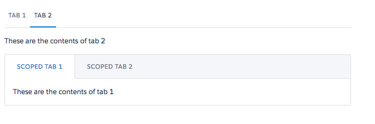

# Tabs Component

A Tabs component consists of one or more tabs [ldsc:tab](tab.md). One tab in the list of tabs should be marked as active, which will be the default tab displayed.

## Attributes
- type (String)	- The theme to be used. Can be either default or scoped

## Example

**Output**


**Component**
```html
<ldsc:lightningDesignApplication >
	<ldsc:tabs>
        <ldsc:tab label="Tab 1" active="true">
            <p>These are the contents of tab 1</p>
        </ldsc:tab>
        <ldsc:tab label="Tab 2">
            <p>These are the contents of tab 2</p>
        </ldsc:tab>
    </ldsc:tabs>
    <ldsc:tabs type="scoped">
        <ldsc:tab label="Scoped Tab 1" active="true">
            <p>These are the contents of tab 1</p>
        </ldsc:tab>
        <ldsc:tab label="Scoped Tab 2">
            <p>These are the contents of tab 2</p>
        </ldsc:tab>
    </ldsc:tabs>
</ldsc:lightningDesignApplication>
```
