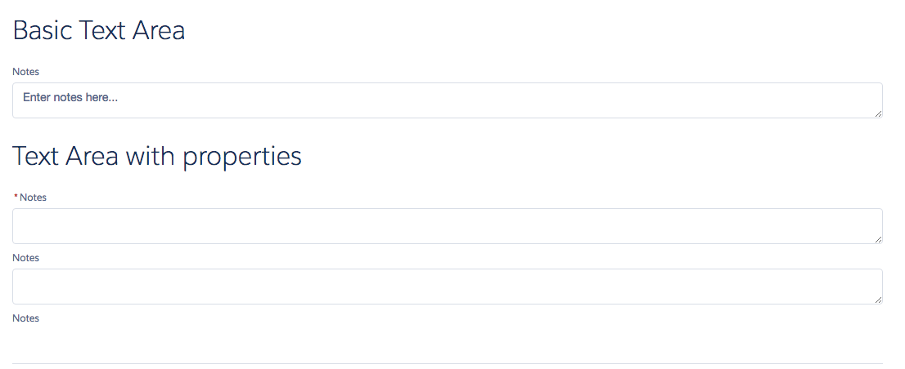
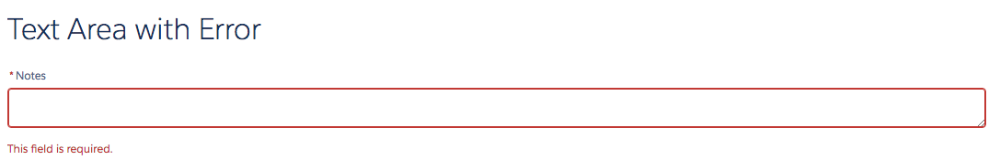

# Text Area Component

Basic Text Area in LDS. Consists of an input with a label. The onChange event is fired when the text area is changed (corresponds to the HTML onkeyup event).

## Attributes
- label	(String) - Label of the input control
- placeholder (String) - Placeholder text of the input control
- value (String) - Value of the input control
- required (Boolean) - Is this field required? Displays a star next to the label. Does not actually perform the validation
- readOnly (Boolean) - Is this field read only?
- disabled (Boolean) - Is this field disabled?
- error (String) - The error message to display. Shows an error below the textarea.

## Events
- onChange (ldsc:basicEvent) - Event fired when input element is changed. The event contains a value param with the current value of the input.
- onLostFocus	(ldsc:basicEvent) - Event fired when focus is removed from the input element
- onFocus	(ldsc:basicEvent) - Event fired when input element is selected

## Example

**Output**



**Component**
```html
<aura:component>
    <ldsc:LightningDesignApplication >

        <h1 class="slds-text-heading--large">Basic Text Area</h1>
    	<ldsc:textarea label="Notes" placeholder="Enter notes here..." onChange="{! c.onChange }" onFocus="{! c.gotFocus }" onLostFocus="{! c.lostFocus }" />

        <h1>{! v.notes }</h1>

        <h1 class="slds-text-heading--large">Text Area with properties</h1>
        <ldsc:textarea label="Notes" required="true" />
        <ldsc:textarea label="Notes" disabled="true" />
        <ldsc:textarea label="Notes" readOnly="true" />

        <h1 class="slds-text-heading--large">Text Area with Error</h1>
        <ldsc:textarea label="Notes" required="true" error="This field is required." />
    </ldsc:LightningDesignApplication>
</aura:component>
```

**Controller**
```js
({
	onChange : function(component, event, helper) {
		component.set('v.notes', event.getParam('value'));
	},

    gotFocus : function(component, event, helper) {
		console.log('Text Area got focus');
	},

    lostFocus : function(component, event, helper) {
		console.log('Text Area got lost focus');
	}
})
```

**Style**
```css
.THIS .slds-text-heading--large {
    margin-top: 20px;
    margin-bottom: 20px;
}

.THIS .slds-text-heading--medium {
    margin-top: 10px;
    margin-bottom: 10px;
}

.THIS .margin-b-20 {
    margin-bottom: 20px;
}
```
