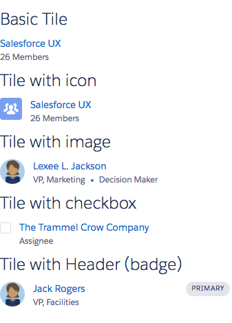

# Tile Component

A tile is a grouping of related information associated with a record. More information can be found on the [LDS website](http://www.lightningdesignsystem.com/components/tiles/).

## Attributes
- title (String) - Title of tile
- media (Component[]) - Media facet
- header (Component[]) - Header facet

## Example

**Output**



**Component**
```html
<aura:component access="GLOBAL">
	<ldsc:lightningDesignApplication>

        <h1 class="slds-text-heading--medium">Basic Tile</h1>
        <ldsc:tile title="Salesforce UX" onClick="{! c.onClick }">
            <p class="slds-truncate">26 Members</p>
        </ldsc:tile>

        <h1 class="slds-text-heading--medium">Tile with icon</h1>
        <ldsc:tile title="Salesforce UX">
            <aura:set attribute="media">
                <ldsc:icon iconType="standard" iconName="groups" iconContainer="true" />
            </aura:set>
            <p class="slds-truncate">26 Members</p>
        </ldsc:tile>

        <h1 class="slds-text-heading--medium">Tile with image</h1>
        <ldsc:tile title="Lexee L. Jackson">
            <aura:set attribute="media">
                <ldsc:image src="/resource/ldsc__SLDS100/assets/images/avatar2.jpg" alt="Avatar" size="small" circle="true" />
            </aura:set>
            <ul class="slds-list--horizontal slds-has-dividers">
                <li class="slds-truncate slds-list__item">VP, Marketing</li>
                <li class="slds-truncate slds-list__item">Decision Maker</li>
            </ul>
        </ldsc:tile>

        <h1 class="slds-text-heading--medium">Tile with checkbox</h1>
        <ldsc:tile title="The Trammel Crow Company">
            <aura:set attribute="media" >
                <ldsc:checkbox label=""/>
            </aura:set>
            <p class="slds-truncate">Assignee</p>
        </ldsc:tile>

        <h1 class="slds-text-heading--medium">Tile with Header (badge)</h1>
        <ldsc:tile title="Jack Rogers">
            <aura:set attribute="header">
                <ldsc:badge>Primary</ldsc:badge>
            </aura:set>
            <aura:set attribute="media">
                <ldsc:image src="/resource/ldsc__SLDS100/assets/images/avatar2.jpg" alt="Avatar" size="small" circle="true" />
            </aura:set>
            <p class="slds-truncate">VP, Facilities</p>
        </ldsc:tile>

    </ldsc:lightningDesignApplication>
</aura:component>
```

**Controller**
```js
({
	onClick : function(component, event, helper) {
		console.log('The tile was clicked');
	}
})
```

**Style**
```css
.THIS .slds-text-heading--medium {
    margin-top: 10px;
    margin-bottom: 10px;
}
```
