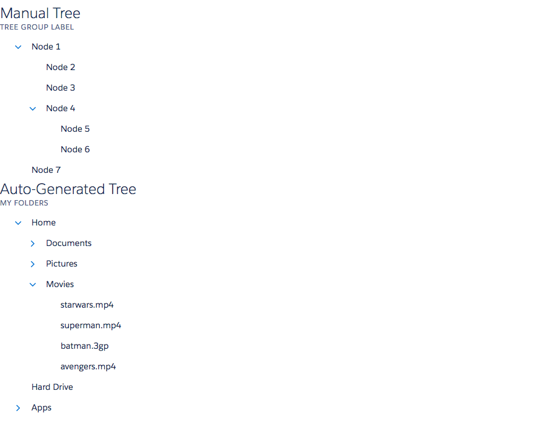

# Tree and Tree Node Components

A tree component in [LDS](http://www.lightningdesignsystem.com/components/trees/). A ldsc:tree component is used along with an ldsc:treeNode component. Each treeNode represents a single node in a tree. A tree can be created manually by providing an hierarchy of tree nodes in the body or can also be created using the nodes attribute on the tree which represents an Object which is a node hierarchy. A node can be opened (expanded) or closed.

## Attributes of ldsc:tree
label (String) - The tree group header.
expandAll (Boolean) - The tree group header.
nodes (Object[]) - The nodes in object form. Used to auto-generate the nodes.

## Events of ldsc:tree
onClick (ldsc:basicEvent) - Called when a single node is clicked. The value param of the event contains the full path of the clicked node.

## Attributes of ldsc:treeNode
label (string) - The tree group header.
open (boolean) - Is this node open?
nodes (object[]) - The nodes in object form. Used to auto-generate the nodes.

## Events of ldsc:treeNode
onClick (ldsc:basicEvent) - Called when a single node is clicked. The value param of the event contains the full path of the clicked node.

## Example

**Output**



**Component**
```html
<aura:component access="GLOBAL">

    <aura:handler name="init" value="{! this }" action="{! c.init }" />

    <aura:attribute name="nodes" type="Object[]" description="Hierarchy of nodes" access="GLOBAL" />

    <ldsc:lightningDesignApplication>
        <h1 class="slds-text-heading--medium">Manual Tree</h1>
        <ldsc:tree label="Tree Group Label" onClick="{! c.handleTreeClick }">
            <ldsc:treeNode label="Node 1">
                <ldsc:treeNode label="Node 2" />
                <ldsc:treeNode label="Node 3" />
                <ldsc:treeNode label="Node 4">
                    <ldsc:treeNode label="Node 5" />
                    <ldsc:treeNode label="Node 6" />
                </ldsc:treeNode>
            </ldsc:treeNode>
            <ldsc:treeNode label="Node 7" />
        </ldsc:tree>

        <h1 class="slds-text-heading--medium">Auto-Generated Tree</h1>
        <ldsc:tree label="My Folders" nodes="{! v.nodes }" onClick="{! c.handleTreeClick }" expandAll="false" />

    </ldsc:lightningDesignApplication>
</aura:component>
```

**Controller**
```js
({
	init : function(component, event, helper) {
		component.set('v.nodes', helper.getSampleNodes());
	},

    handleTreeClick: function(component, event, helper) {
    	console.log(event.getParam('value'));
	}
})
```

**Helper**
```js
({
	getSampleNodes : function() {
		return [{
          "label": "Home",
          "children": [
            {
              "label": "Documents",
              "children": [
                {
                  "label": "information.pdf",
                  "children": []
                },
                {
                  "label": "data.pdf",
                  "children": []
                },
                {
                  "label": "random.docx",
                  "children": []
                }
              ]
            },
            {
              "label": "Pictures",
              "children": [
                {
                  "label": "wedding.png",
                  "children": []
                },
                {
                  "label": "house.jpg",
                  "children": []
                }
              ]
            },
            {
              "label": "Movies",
              "children": [
                {
                  "label": "starwars.mp4",
                  "children": []
                },
                {
                  "label": "superman.mp4",
                  "children": []
                },
                {
                  "label": "batman.3gp",
                  "children": []
                },
                {
                  "label": "avengers.mp4",
                  "children": []
                }
              ]
            }
          ]
        },
        {
          "label": "Hard Drive",
          "children": []
        },
        {
          "label": "Apps",
          "children": [
            {
            "label": "LoginHelper.app",
            "children": []
            },
            {
              "label": "Office.app",
              "children": []
            },
            {
              "label": "Chrome.app",
              "children": []
            }
          ]
        }];
	}
})
```

**Style**
```css
.THIS .slds-text-heading--medium {
    margin-top: 30px;
    margin-bottom: 10px;
}
```
